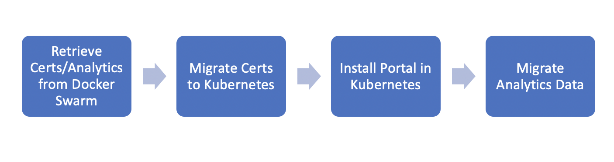

# Migrate from Docker Swarm or Helm 2 Chart (v4.4 and above)
This migration assumes that you have an external MySQL Deployment that is accessible by both Docker Swarm and your Kubernetes Cluster. This guide has not been tested against Postgres. If you are using Postgres outside of your development environment, Broadcom recommends that you migrate to MySQL. 

* [Docker Swarm](#migrate-from-docker-swarm)
* [Helm 2 Chart](#migrate-from-helm2)
* [Migrate Analytics Data](#migrate-analytics)
* [ServiceAccount/RBAC Settings](#rbac-settings)


## Migrate from Docker Swarm
This guide covers migrating certificates and analytics data from Docker Swarm to Kubernetes

#### High Level


***Read Migrate Analytics before proceeding with installation!!***

1. SSH into your Docker Swarm Portal Node
   - ```$ curl https://raw.githubusercontent.com/CAAPIM/apim-charts/master/utils/portal-migration/swarm/docker-swarm-migrate.sh > docker-swarm-migrate.sh```
   - ```$ chmod +x docker-swarm-migrate.sh```
   - ```./docker-swarm-migrate.sh -p </path/to/portal/certs/folder/> -a certs```
   - ***this produces certificates.tar.gz***

2. On a machine that ***has access via kubectl*** to the Kubernetes cluster you intend to deploy the Portal on
   - ```$ mkdir migration```
   - ```$ cd migration```
   - ```$ scp <username>@<swarm-ip>:/path/to/certificates.tar.gz .```
   - ```$ curl https://raw.githubusercontent.com/CAAPIM/apim-charts/master/utils/portal-migration/kubernetes/migrate-certificates.sh > migrate-certificates.sh```
   - ```$ chmod +x migrate-certificates.sh```
   - ```$ ./migrate-certificates.sh -n <kubernetes-namespace>```
   - ***your certificates should now be in your kubernetes cluster*** 

3. Configure Portal Pre-requisites
   - Copy this [file](../../charts/portal/values-production.yaml) to your machine as <my-values.yaml> - contains a production version of values.yaml that will be applied to your portal when you install the Chart.
   - Update the following values in this file.
      ```
      global.legacyHostnames: true
      global.legacyDatabaseNames: true
      global.databaseHost: <host>
      global.databaseUsername: <username>
      global.databasePassword <password>
      global.databasePort: <port> default 3306
      tls.job.enabled: false
      portal.domain: <domain> default example.com
      portal.enrollNotificationEmail: <enrollNotificationEmail> default noreply@mail.example.com
      ingress.tenantIds <list of existing tenants> default tenant1
      portal.papi.port: 9443 default 443```
  - uncomment and fill namespace in ingress-nginx
     ```
     #  tcp:
        # 9443: "<namespace>/dispatcher:9443"
     ```
   - Update any other values that you'd like to set (i.e. SMTP settings) [link](../../README.md)
 

## Migrate from Helm2
This guide covers migrating certificates the old Helm2 to the new Helm3 Chart. Persistent volume naming conventions haven't changed so the transition is relatively simple.

1. Load Certificates
   - ```$ curl https://raw.githubusercontent.com/CAAPIM/apim-charts/master/utils/portal-migration/kubernetes/migrate-certificates.sh > migrate-certificates.sh```
   - ```$ chmod +x migrate-certificates.sh```
   - ```$ ./migrate-certificates.sh -n <kubernetes-namespace> -p /path/to/portal-helm-charts/files -k <certpass>```

2. Prepare your values.yaml file
   - Copy this [file](../../charts/portal/values-production.yaml) to your machine as <my-values.yaml> - contains a production version of values.yaml that will be applied to your portal when you install the Chart.
   - Update the following values in this file.
      ```
      global.databaseHost: <host>
      global.databaseUsername: <username>
      global.databasePassword <password>
      global.databasePort: <port> default 3306
      tls.job.enabled: false
      portal.domain: <domain> default example.com
      portal.enrollNotificationEmail: <enrollNotificationEmail> default noreply@mail.example.com
      ingress.tenantIds <list of existing tenants> default tenant1
      ```
   - If you already have an ingress controller, then make sure that ingress.create is set to false.
   - Update any other values that you'd like to set (i.e. SMTP settings) [link](../../README.md)
3. Migrate analytics - see [Helm 2.x](#helm-2.x)
   - if you'd like to skip migrating analytics update the following in <my-values.yaml>
      ```druid.minio.replicaCount: 1```
4. Remove the old Portal Helm Chart ***Analytics volumes will be retained automatically***
  - ```$ helm2 delete --purge <portal-release-name>```
5. If you have exported your analytics and wish to run minio in distributed mode
  - ```$ kubectl delete pvc minio-vol-claim-minio-0 -n <namespace>``` ***WARNING: make sure $PWD/analytics is not empty!!***
  - Only if you are migrating from Helm 2.x(non-HA deployment) to Helm 3.x(HA deployment i.e running Kafka, Zookepeer and other services in distributed mode), please do the following
      - ```$ kubectl delete pvc kafka-vol-claim-kafka-0 -n <namespace>```
      - ```$ kubectl delete pvc zookeeper-vol-claim-zookeeper-0 -n <namespace>```
      - ```$ kubectl delete pvc historical-vol-claim-historical-0 -n <namespace>```
6. Install the new Chart
   - ```$ helm repo add portal https://caapim.github.io/apim-charts/```
   - ```$ helm repo update```
   - ```$ helm install <release-name> portal/portal --set-file "portal.registryCredentials=/path/to/docker-secret.yaml" -f <your-values-production.yaml>```
7. Update Portal DNS records to point at the Kubernetes Portal
   - [Techdocs](https://techdocs.broadcom.com/us/en/ca-enterprise-software/layer7-api-management/api-developer-portal/5-0/install-configure-and-upgrade/install-portal-on-docker-swarm/configure-your-dns-server.html)

## Migrate Analytics
The Portal makes use of Minio which acts as a S3 filestore providing a medium to different Cloud Storage solutions. This migration extracts the deep storage data from Minio. Analytics are written to deep storage on an hourly interval. ***NOTE:*** the current hour is not backed up.

### Export Data

#### Docker Swarm
From your docker swarm node run the following and copy to a machine ***that has access via kubectl*** to the Kubernetes cluster you intend to deploy the Portal on

1. Retrieve Analytics Data from Minio
   - ```$ ./docker-swarm-migrate.sh -a analytics``` ***this produces analytics.tar.gz***
2. Proceed with Portal Installation.
   - ```$ helm repo add portal https://caapim.github.io/apim-charts/```
   - ```$ helm repo update```
   - ```$ helm install <release-name> portal/portal --set-file "portal.license.value=/path/to/license.xml,portal.registryCredentials=/path/to/docker-secret.yaml" -f <your-values-production.yaml```
3. Update Portal DNS records to point at the Kubernetes Portal (the output of the install/upgrade will display the Portal Hostnames you'll need to add)
   - [Techdocs](https://techdocs.broadcom.com/us/en/ca-enterprise-software/layer7-api-management/api-developer-portal/5-0/install-configure-and-upgrade/install-portal-on-docker-swarm/configure-your-dns-server.html)

#### Helm 2.x
1. Get your machines local IP Address
    - ```export HOST_IP=<ip-address-of-your-machine>```
      ##### On a Macbook 
      - ```$ ipconfig getifaddr en0```
      ##### On Linux
      - ```$ hostname -I | awk '{print $1}'```
2. Port-forward to your Kubernetes minio instance (on a separate shell)
   - ```$ kubectl port-forward svc minio --address 0.0.0.0 9000 -n <namespace>```
3. Use Minio mc to copy your data to a local directory
   - ```$ docker run -e BUCKET_NAME=api-metrics -e ACCESS_KEY=minio -e SECRET_KEY=minio123 -e HOST_IP=$HOST_IP -v $PWD/analytics/api-metrics:/opt/api-metrics -it --entrypoint=/bin/sh minio/mc```
   - ```$ mc alias set portal http://$HOST_IP:9000 $ACCESS_KEY $SECRET_KEY```
   - ```$ mc mirror portal/api-metrics /opt/api-metrics```
4. Go back to step 4 of [Migrate from Helm2](#migrate-from-helm2)

### Import Data

### Using Kubernetes PVCs (default)
This is the standard supported option, the production-values.yaml you started from deploys 4 replicas as per Minio guidelines. The migration makes use of the minio/mc docker container, this is the easiest way to move data across.

1. Get your minio credentials from Kubernetes
   - ```export ACCESS_KEY=$(kubectl get secret minio-secret -n <namespace> -o 'go-template={{index .data "MINIO_ACCESS_KEY" | base64decode }}')```
   - ```export SECRET_KEY=$(kubectl get secret minio-secret -n <namespace> -o 'go-template={{index .data "MINIO_SECRET_KEY" | base64decode }}')```
   - ```export BUCKET_NAME=api-metrics``` ***If using a Cloud Storage Provider, see Using Cloud Storage and update the bucket name to reflect what you have created.***
   - ```export HOST_IP=<ip-address-of-your-machine>```
      ##### On a Macbook 
      - ```$ ipconfig getifaddr en0```
      ##### On Linux
      - ```$ hostname -I | awk '{print $1}'```

2. Port-forward to your Kubernetes minio instance (on a separate shell)
   - ```$ kubectl port-forward svc minio --address 0.0.0.0 9000 -n <namespace>```

3. Prepare analytics and use Minio mc to sync with your Kubernetes Portal
   - ```$ tar -xvf analytics.tar.gz``` ***Docker Swarm Only***
   - ```$ docker run -e BUCKET_NAME=$BUCKET_NAME -e ACCESS_KEY=$ACCESS_KEY -e SECRET_KEY=$SECRET_KEY -e HOST_IP=$HOST_IP -v $PWD/analytics/api-metrics:/opt/api-metrics -it --entrypoint=/bin/sh minio/mc```
   - ```$ mc alias set portal http://$HOST_IP:9000 $ACCESS_KEY $SECRET_KEY```
   - ```$ mc mirror /opt/api-metrics portal/$BUCKET_NAME```
   - [Restart Analytics Services](#restart-analytics-services)

### Using Cloud Storage
We've exposed this Minio functionality in Kubernetes, if you'd like to use Amazon S3, Google GCS or Azure Blob Storage then simply
1. Go to your chosen cloud storage provider
2. Create a storage bucket
3. In your <my-values.yaml> file
   - druid.minio.cloudStorage: true
   - druid.minio.bucketName: <name-of-the-bucket-you-created-on-the-storage-provider>
   - druid.minio.<gateway>.enabled
   - relevant credentials - see below
   - Azure blob storage - this uses the access/secret key of minio, set these to your Azure Blob Storage credentials
   - Google GCS - this uses an authentication file (json) and project name, for the json file use --set-file "druid.minio.gcsgateway.gcsKeyJson=/path/to/auth.json" or paste this in your <my-values>.yaml file in the correct format.
   - Amazon S3 - this uses access/secret key of a user that has S3 permissions.
   - For more details see ==> https://docs.min.io/docs/
4. Update Druid Metadata
   - ```$ curl https://raw.githubusercontent.com/CAAPIM/apim-charts/master/utils/portal-migration/druid-meta-update/druid-meta-update.sh > druid-meta-update.sh```
   - ```$ chmod +x druid-meta-update.sh```
   - ```$ ./druid-meta-update.sh -u <database-username> -p <database-password> -h <database-host> -d <database-name> -p <database-port> -b <bucket-name>```
5. [Restart Analytics Services](#restart-analytics-services)

### Restart Analytics Services
The Middle Manager and Coordinator services need to restarted.
- ```$ kubectl rollout restart statefulset coordinator -n <namespace>```
- ```$ kubectl rollout restart statefulset middlemanager -n <namespace> ```


## RBAC Settings
If you have RBAC enabled in your Kubernetes Cluster serviceAccounts can be set in <my-values.yaml>

``` 
serviceAccount.create: <true|false>
serviceAccount.name: <serviceAccountName>
rbac.create: <true|false>
druid.serviceAccount.create: <true|false>
druid.serviceAccount.name: <serviceAccountName>
rabbitmq.serviceAccount.create: <true|false>
rabbitmq.serviceAccount.name: <serviceAccountName>
rabbitmq.rbac.create: <true|false>
ingress-nginx.podSecurityPolicy.enabled: <true|false>
ingress-nginx.serviceAccount.create: <true|false>
ingress-nginx.serviceAccount.name: <true|false>
ingress-nginx.rbac.create: <true|false>
```

## Steps to update enrolled Gateways (TODO)
1. Restart Portal Deployer if using the on-demand deployment type.
   - Launch Policy Manager and connect to your enrolled API Gateway
   - Tasks ==> Global Settings ==> Manage Cluster-Wide Properties 
   - toggle portal.deployer.enabled ==> set to false, then to true
2. Confirm you are able to deploy APIs to your Gateway as expected.

## Troubleshooting
This section will be updated as we encounter problems related to installing/migrating the Portal to this form factor
- These guides do not currently include migrating MySQL/PostgresSQL databases
- Please raise a support ticket with Broadcom if you encounter problems, raising a bug/feature request against this repository in parallel should result in faster turnaround.
